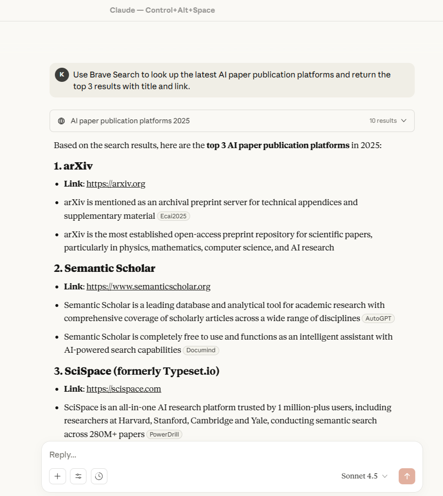
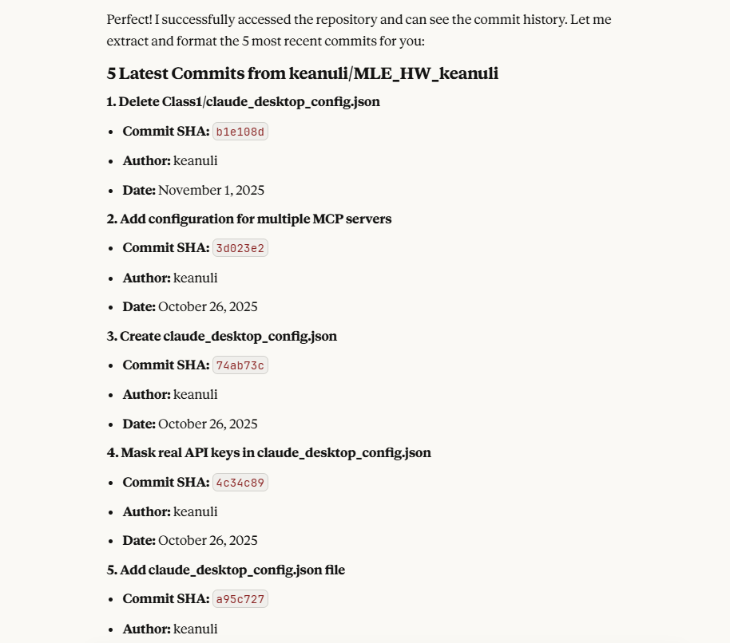
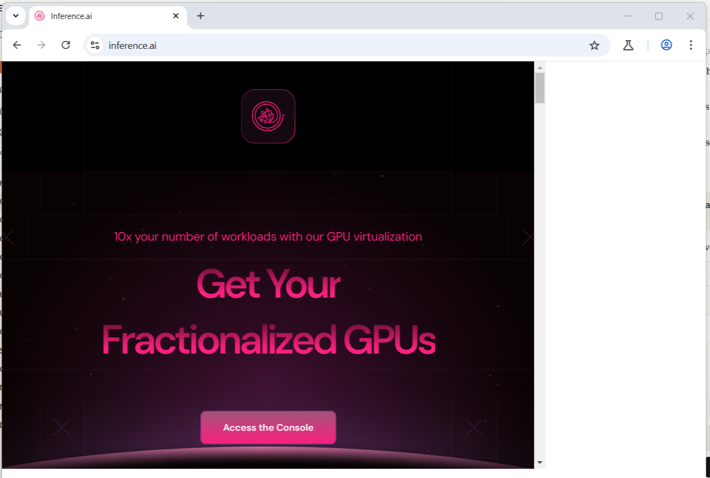
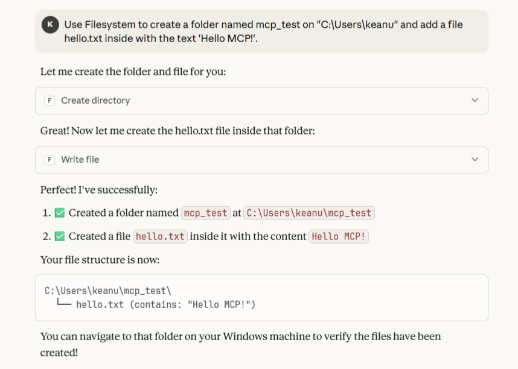
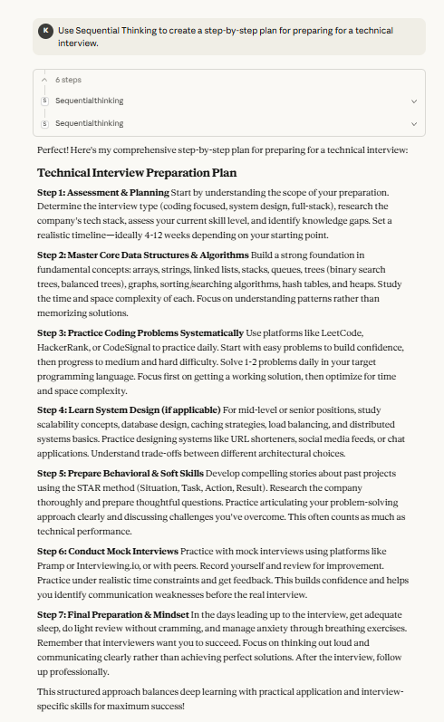
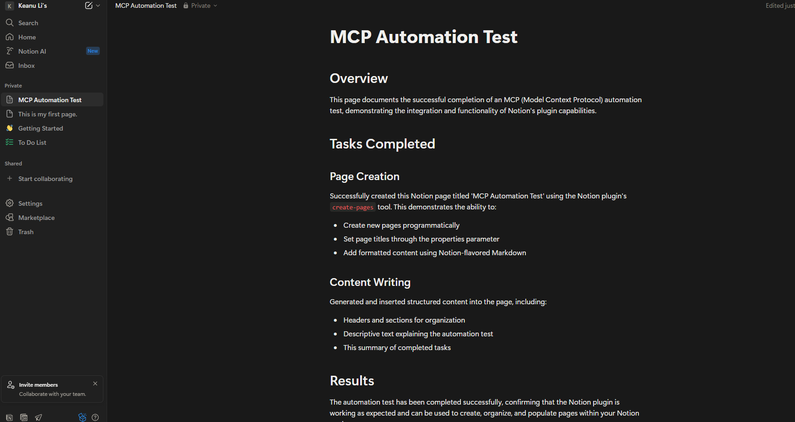

### 1. Brave Search MCP output screenshot

### 2. Github MCP output screenshot

 
### 3.Puppeteer MCP output screenshot

### 4.Filesystem MCP output screenshot

### 5.Sequential Thinking MCP output screenshot

### 6.Notion MCP output screenshot

